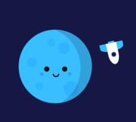
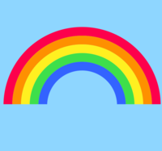
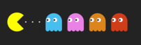

# 100 CSS illustrations

The scope of this repository is to play around with CSS and HTML as a way to learn by building illustrations.

- [100 CSS illustrations](#100-css-illustrations)
- [List of illustrations](#list-of-illustrations)
  - [Some previews](#some-previews)
- [Resources](#resources)
  - [Tutorials](#tutorials)
  - [Editors](#editors)
  - [CSS Shapes](#css-shapes)
  - [Gradients](#gradients)
  - [Color palettes](#color-palettes)
  - [Border radius](#border-radius)
  - [SVG](#svg)
  - [Clip path](#clip-path)
- [Tips, tricks and snippets](#tips-tricks-and-snippets)
  - [Border](#border)
  - [Centering](#centering)


# List of illustrations

Each illustration contains a README file detailing tips to take into account during implementation.
1. [Blue Moon animation](./projects/animations/blue-moon/README.md)
2. [Heart Envelope animation](./projects/animations/heart-envelope/README.md)
3. [Rainbow animation](./projects/animations/rainbow/README.md)
4. [Pacman](./projects/plain/pacman/README.md)
5. [Pepsi logo](./projects/logos/pepsi/README.md)
6. [Camera](./projects/plain/camera/README.md)

## Some previews








# Resources

## Tutorials
- [Coding Artist](https://www.youtube.com/channel/UC15exV5s79D_aYGADudlwpQ)

## Editors

- [CSS Battle](https://cssbattle.dev/)

## CSS Shapes
- [The shapes of CSS](https://css-tricks.com/the-shapes-of-css/)
- [Neumorphism](https://neumorphism.io)

## Gradients
- [Gradients](https://cssgradient.io)

## Color palettes
- [Coolers](https://coolers.co)

## Border radius
- [Fancy borde radius](https://fancy-border-radius.com)


## SVG
- [Mozilla SVG](https://developer.mozilla.org/en-US/docs/Web/SVG)
- [CSS Tricks SVG](https://css-tricks.com/using-svg/)
- [Everything you need to know about SVG](https://css-tricks.com/lodge/svg/)
- [Pocket Guide](https://svgpocketguide.com/)

## Clip path
- [Clip path](https://css-tricks.com/almanac/properties/c/clip-path/)
- [Clip path editor](https://codepen.io/stoumann/full/abZxoOM)

# Tips, tricks and snippets

## Border

It's possible to create shapes by using the `border` attribute and setting `width` and `height` to `0`. This allows for room to play with the four sides of a rectangle.

```
{
    width: 0;
    height: 0;
    border-top: ...;
    border-bottom: ...;
    border-left: ...;
    border-right: ...;
}
```

## Centering

Often, you will need to center a child inside its parent. A fast way to do so is to add the following snippet in the parent element:

```
{
    display: flex;
    justify-content: center;
    align-items: center;
}
```
