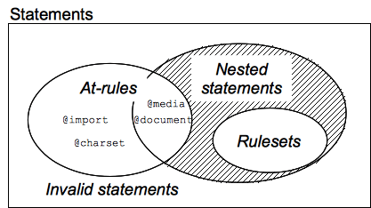

# Blue Moon

- [Blue Moon](#blue-moon)
  - [Preview](#preview)
  - [Credits](#credits)
  - [Key concepts](#key-concepts)
  - [Breaking it down](#breaking-it-down)
  - [What I learnt](#what-i-learnt)
    - [Shapes](#shapes)
    - [At-rules](#at-rules)
    - [Positioning](#positioning)
    - [Animation](#animation)
    - [Pseudo-elements](#pseudo-elements)
  - [Code snippets](#code-snippets)
  - [Resource links](#resource-links)

## Preview


## Credits

This illustration was coded following a [YouTube tutorial](https://www.youtube.com/watch?v=pD10-PocoQQ) made by [Mitali Jadhavrao](https://codingartistweb.com/about/). She found inspiration on [this Blue Moon](https://dribbble.com/shots/2614761-Blue-Moon) dribbble shot by [MBE](https://dribbble.com/Madebyelvis).

## Key concepts
- Breaking down the illustration into smaller elements helps approach the implementation.
- Positioning: relatively positioned elements can be used as a container for out-of-flow children elements.
- Animating.
- Transforming.
- Pseudo-elements.

## Breaking it down
Creating an illustration with CSS becomes much easier once you're able to break down the design into smaller elements that are easier to implement. For example, for this illustration I identified two main elements:
- The **moon**. It has 5 craters with shadows, two eyes, a mouth, some blush and a bit of shadow.
- The **orbit**. Contains a rocket with a window on it, wings and a bottom part. The rocket flies around the moon.

Once you establish what are the different elements you need to draw, it is time to think about what shapes they might correspond with. Some figures might be harder to break down and it might help to imagine them in their most basic shapes, in other words, without taking account the radius of the element's corners.


In this case, here's the mental model I used to implement this illustration:
| Element | Basic shape | Final shape
|---|---|---|
|Moon|Square|Circle
|Moon shadow|Square|Circle
|Eyes|Square|Circle
|Mouth|Rectangle|Rectangle with soft edges
|Blush|Square|Circle
|Crater|Square|Circle
|Orbit|Square|Circle
|Rocket|Rectangle|Half oval
|Rocket wings|Rectangle|Rectangle with soft edges
|Rocket bottom|Rectangle|Rectangle with soft edges
|Rocket window|Square|Circle

## What I learnt

### Shapes
I realized that it is much easier to implement an illustration if I'm able to break it down into smaller and easier to implement elements.

### At-rules
While reading documentation about animations, I came across the term at-rules. Even though I had uesd them in the past, I did not know the specifics.

At-rules are CSS statements that provides CSS with instructions on how to behave. They begin with an at sign, `@`, followed by an identifier and includes everything up to the next semicolon, `;`, or the next CSS block, whichever comes first.



There are several regular at-rules, designated by their identifiers, each with a different syntax:
- `@charset`: Defines the character set used by the style sheet.
- `@import`: Tells the CSS engine to include an external style sheet.
- `@namespace`: Tells the CSS engine that all its content must be considered prefixed with an XML namespace.

Similarly, nested rules contain a subset of additional statements, some of which might be conditional to a specific situation. They might be used as a statement of a style sheet as well as inside of conditional group rules. `@keyframes` is an example of a nested rule.

### Positioning
Working on this illustration allowed me to review my knowledge on how positioning works.

The normal flow of a page describes the way in which elements are displayed on a page before any changes are made to their layout. There are three main ways elements are positioned: display types, floats and positioning.

The CSS `position` property defines the position type of an element in a document, it might be in-flow (`static`, `relative`) or out-of-flow (`absolute`, `fixed`). Elements are then positioned using the `z-index`, `left`, `right`, `top` and `bottom` properties, which work differently depending on the position value.

A **positioned** element is an element with a `position` value different than `static`, which is the default value.

- Elements with `position: relative` are positioned relative to their normal position in the flow of the document. It's possible to use properties to adjust its position away from the normal one, however, doing so will not make other content adjust to fit into the gap left. When it comes to making illustrations, an important characteristic is that a relatively positioned element can be used as a container for out-of-flow children elements. The out-of-flow positioned elements will respect the box boundaries of the relatively positioned element.
- Elements with `position: absolute` are positioned relative to their closest **positioned** ancestor. That means an element that has a position value other than `position: static`, otherwise it will be positioned using the document body as a reference. Absolute positoined elements are removed from the normal document flow and can overlap other elements.

### Animation

Using the `animation` property and the `keyframes` at-rule to make the rocket move around the moon allowed me to consolidate my knowledge on the right syntaxis.

### Pseudo-elements
Up until now, I did not have a lot of experience using pseudo-elements.
A CSS pseudo-element is a keyword added to a selector that lets you style a specific part of the selected element(s).

I learnt that it is preferred syntaxis to use double colons (`::`) and that they won't be visible if they do not have a set value for the `content` property.

## Code snippets

```
.container {
    position: absolute;
    top: 0;
    bottom: 0;
    left: 0;
    right: 0;
}
```
Pseudo-elements
```
.my-element:before {
    content: "";
}
```
Positioning
```
.orbit {
    position: absolute;
}
.rocket {
    position: relative;
    top: 115px;
    left: -11px;
}
```
Animation syntax

```
    animation: animation-name speed iteration-count direction;
```
Keyframes syntax

```
    @keyframes animationname {keyframes-selector {css-styles;}}
```
## Resource links
[Positioning](https://css-tricks.com/almanac/properties/p/position/)

[Transform rotate](https://css-tricks.com/almanac/properties/p/position/)

[At-rules](https://developer.mozilla.org/en-US/docs/Web/CSS/At-rule)

[At-rules II](https://css-tricks.com/the-at-rules-of-css/)
