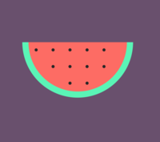

# Watermelon

- [Watermelon](#watermelon)
  - [Preview](#preview)
  - [Key concepts](#key-concepts)
  - [Credits](#credits)
  - [Breaking it down](#breaking-it-down)

## Preview

## Key concepts
- The :nth-child() CSS pseudo-class matches elements based on their position among a group of siblings.

## Credits

This illustration was coded following a [Udemy course](https://www.udemy.com/course/creative-css-drawing-course-make-art-with-css) created by [Ahmed Sadek](https://www.udemy.com/user/ahmed-el-sayed-sadek/).

## Breaking it down
Creating an illustration with CSS becomes much easier once you're able to break down the design into smaller elements that are easier to implement. For example, for this illustration I identified two main elements:
- **Watermelon**.
- **Seeds**.

Once you establish what are the different elements you need to draw, it is time to think about what shapes they might correspond with. Some figures might be harder to break down and it might help to imagine them in their most basic shapes, in other words, without taking account the radius of the element's corners. 

Element | Shape
--- | ---
Watermelon | Half circle
Seeds | Circle
